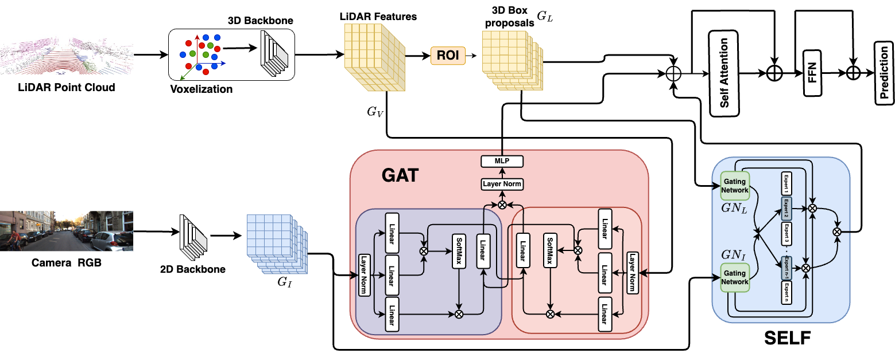

# Quantum Inverse Contextual Vision Transformers (Q-ICVT): A New Frontier in 3D Object Detection for AVs (CIKM 2024 Accepted)

  

This is the official implementation of [**Quantum Inverse Contextual Vision Transformers (Q-ICVT): A New Frontier in 3D Object Detection for AVs**]

## **Abstract** 
The field of autonomous vehicles (AVs) predominantly leverages multi-modal integration of LiDAR and camera data to achieve better performance compared to using a single modality. However, the fusion process encounters challenges in detecting distant objects due to the disparity between the high resolution of cameras and the sparse data from LiDAR. Insufficient integration of global perspectives with local-level details results in sub-optimal fusion performance.To address this issue, we have developed an innovative two-stage fusion process called Quantum Inverse Contextual Vision Transformers (Q-ICVT). This approach leverages adiabatic computing in quantum concepts to create a novel reversible vision transformer known as the Global Adiabatic Transformer (GAT). GAT aggregates sparse LiDAR features with semantic features in dense images for cross-modal integration in a global form. Additionally, the Sparse Expert of Local Fusion (SELF) module maps the sparse LiDAR 3D proposals and encodes position information of the raw point cloud onto the dense camera feature space using a gating point fusion approach. Our experiments show that Q-ICVT achieves an mAPH of 82.54 for L2 difficulties on the Waymo dataset, improving by 1.88\% over current state-of-the-art fusion methods. We also analyze GAT and SELF in ablation studies to highlight the impact of Q-ICVT.

## **Datasets** ##
|Dataset Name|Link|
|----|----|
|Waymo open Dataset|[link](https://console.cloud.google.com/storage/browser/waymo_open_dataset_motion_v_1_2_0)|
